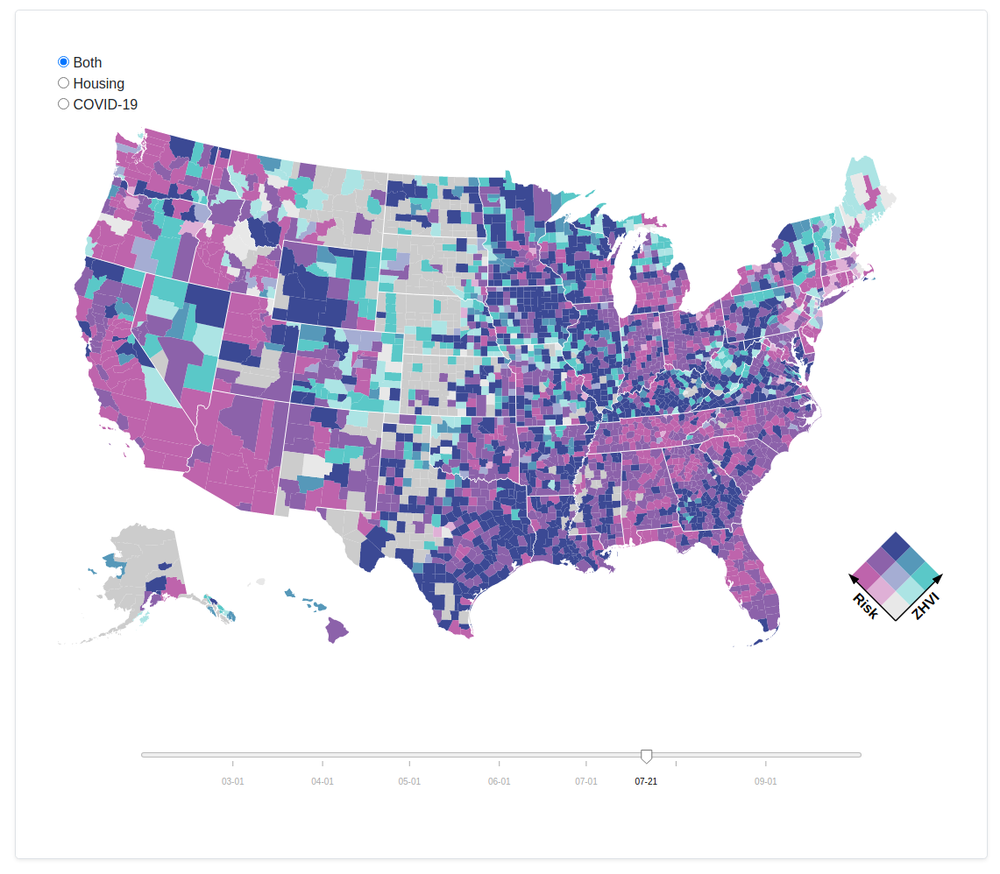

# Buying a House During COVID-19



## Installation

Clone the repository and follow the directions in [prepare the data](prepare-the-data). Place the dataset in the root of the repository.

## Usage

Run a simple [Python web server](https://docs.python.org/3/library/http.server.html) from the root of the repository:

```python
python -m http.server 8000
```

Navigate to [0.0.0.0:8000](http://0.0.0.0:8000/) to see the choropleth.

## Prepare the Data

### COVID Data
To acquire the COVID-19 data, download the [google open data](https://github.com/GoogleCloudPlatform/covid-19-open-data). Make sure to grab the `main.csv`

### Housing Data
To acquire the housing data go to [Zillow](https://www.zillow.com/research/data/) and download the ZHVI by county.

### Create the joined dataset
This repository provides the script [clean_data](/clean_data.py) to create the joined dataset. It can be run with
```bash
./clean_data.py --housing <path_to_housing> --covid <path_to_covid> --output <output_file_name>
```
The dependencies needed to run this script are provided in form a [conda environment](/covid_housing_env.yml)

The cleaned dataset has the schema
```
 0   date             1155225 non-null  datetime64[ns]
 1   county_fips      1155225 non-null  object
 2   population       1155225 non-null  Int64
 3   total_confirmed  853236 non-null   Int64
 4   new_confirmed    849995 non-null   Int64
 5   Zhvi             1043100 non-null  float64
 ```

### Forecast
You can use your favorite method to forecast the data. We used AutoML on AWS.

### Create the forecasted dataset
```bash
./clean_data.py --housing <path_to_housing> --covid <path_to_covid> --forecast <output_file_name> --output <output_file_name>
```
